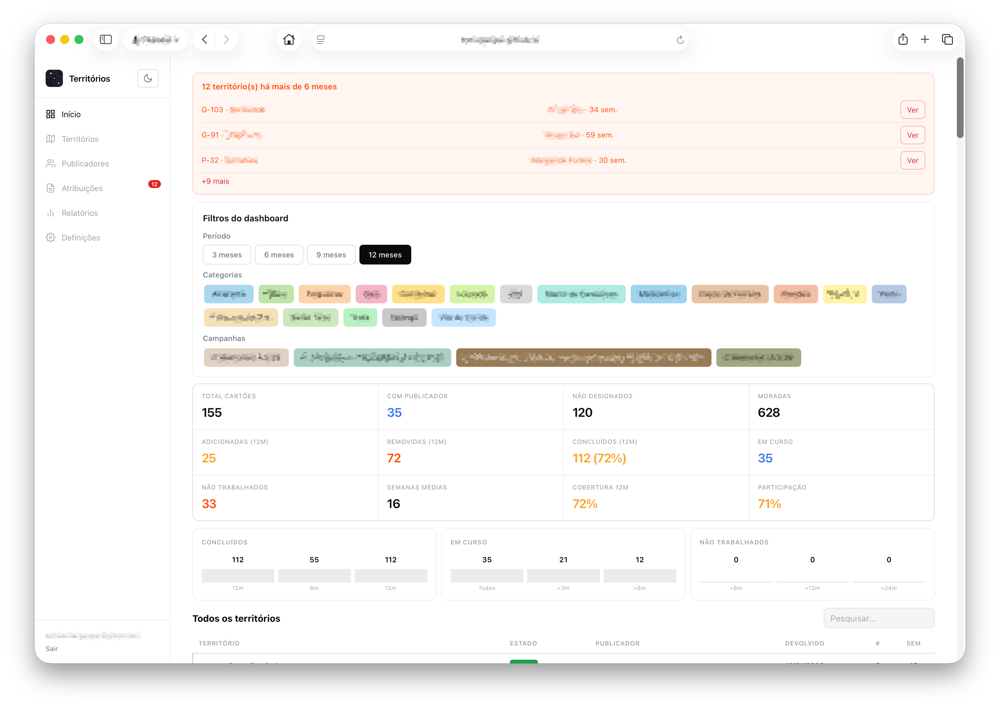
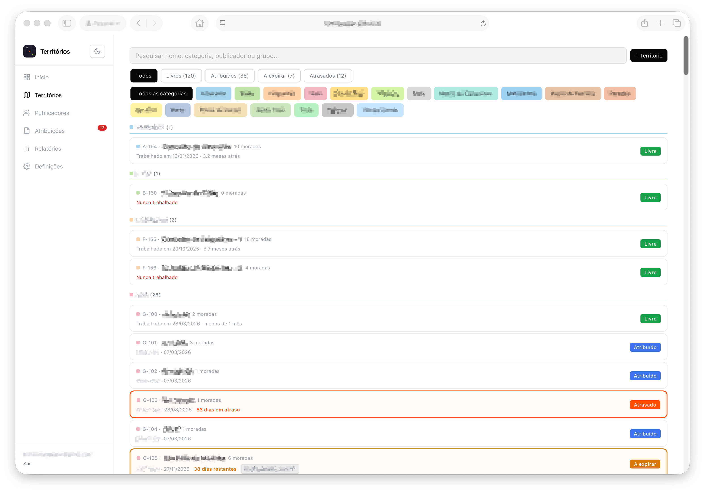
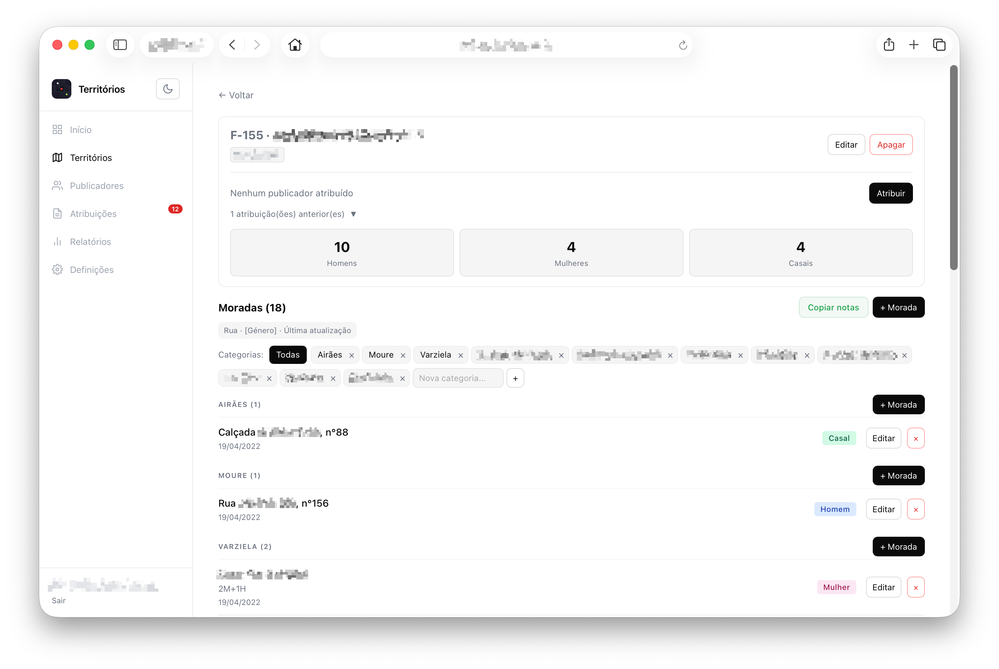
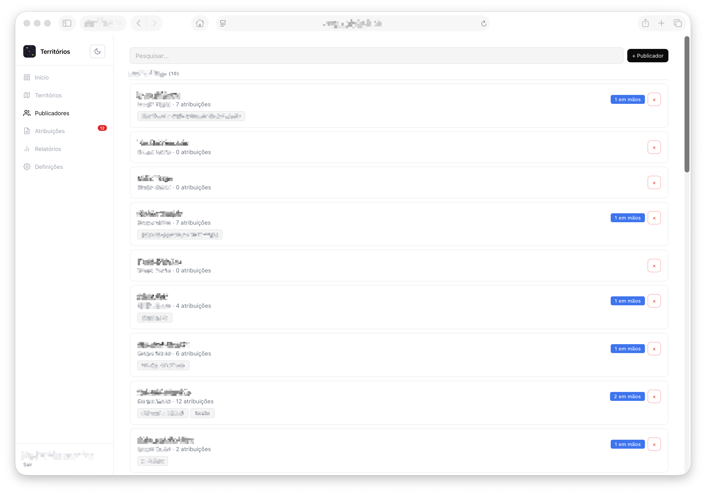
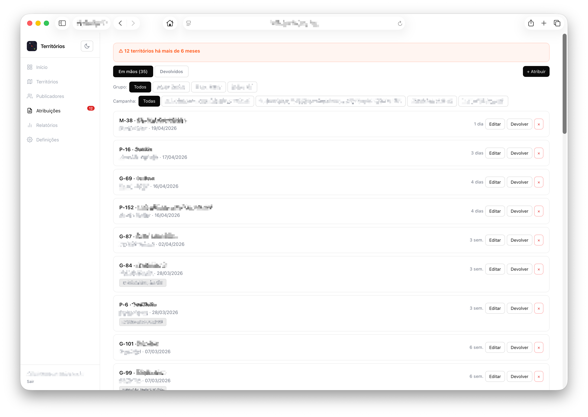
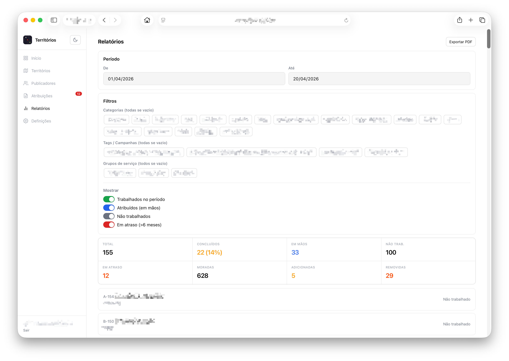
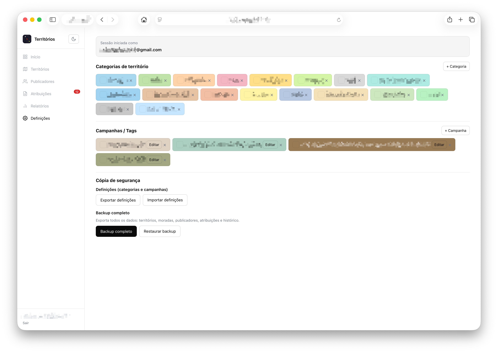

<picture align="center">
  <source media="(prefers-color-scheme: dark)" srcset="screenshots/banner.png">
  <source media="(prefers-color-scheme: light)" srcset="screenshots/banner-nt.png">
  
</picture>

  

  

---
## Territórios

Lista completa de territórios organizados por categoria. Cada categoria tem uma cor associada visível nos cards e nos filtros.

Filtros disponíveis: Todos · Livres · Atribuídos · A expirar · Atrasados. A pesquisa funciona por nome, número, categoria, publicador ou grupo de serviço.

Os territórios livres mostram quando foram trabalhados pela última vez e há quantos meses. Os atribuídos mostram a quem estão e quantos dias ou semanas faltam para os 6 meses.

  

---

## Moradas

Cada território tem uma lista de moradas com tipo (Homem · Mulher · Casal), notas, data e categoria interna. As moradas marcadas como "Não visitar" aparecem numa secção separada a vermelho.

O botão **Copiar notas** gera um texto formatado com todas as moradas agrupadas por categoria, incluindo tipo e data de última atualização — pronto para enviar.

Cada remoção fica registada no histórico com data e motivo opcional.

  

---

## Publicadores

Registo de publicadores por grupo de serviço. Mostra quais os territórios que cada publicador tem em mãos.

  

---

## Atribuições

Atribuição de territórios a publicadores ou grupos de serviço, com datas e tags de campanha. O sistema alerta automaticamente quando um território está atribuído há mais de 6 meses.

Filtros por grupo de serviço e campanha. Cada atribuição mostra o tempo decorrido em dias ou semanas.

  

---

## Relatórios

Estatísticas por período (3 / 6 / 9 / 12 meses) com filtros por categoria e campanha. Inclui territórios concluídos com percentagem, em mãos, não trabalhados, em atraso e movimentos de moradas (adicionadas e removidas).

Exportação para PDF com tabela completa e histórico de moradas.

  

---

## Definições

Gestão de categorias e campanhas com cores personalizadas e datas informativas. Exportação e importação de backup completo de todos os dados.

  

